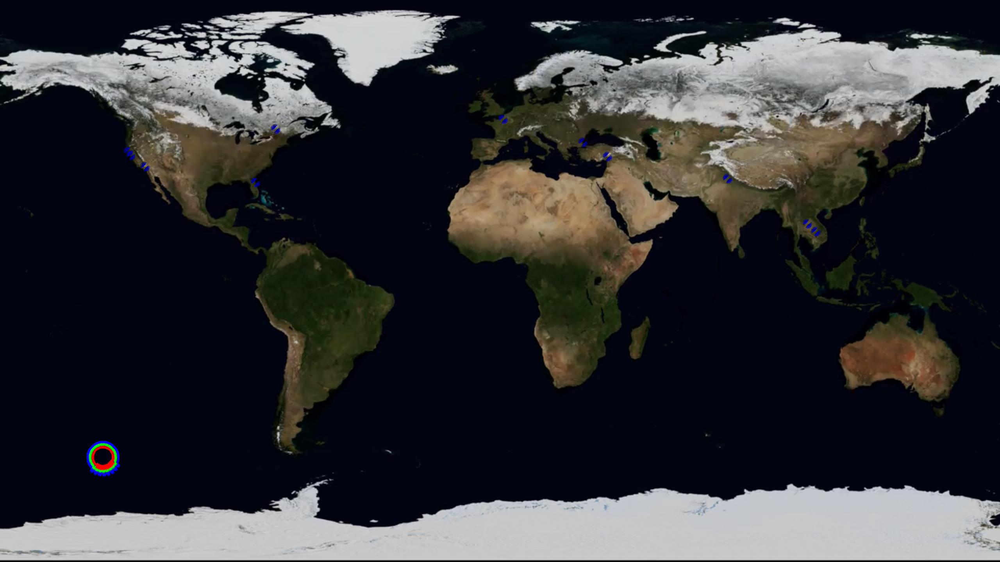

# The SoundScape 

This is my Music 256A final project (I call it the SoundScape) . The explanation of the project has been divided into the following five parts :- 

   <b> 1. Introduction and Motivation </b>

   <b> 2. Application Components  </b>

   <b> 3. Software Components </b>

   <b> 4. Setting up the project on your system </b>

   <b> 5. Resources </b>

# 1. Introduction and Motivation

When I heard the Virtual Barbershop(https://www.youtube.com/watch?v=IUDTlvagjJA)  for the first time six years ago (which employs HRTF's and spatialized audio rendering) it triggered my curiousity and imagination. The first time I heard it I was blown away by the fact that our ears could be employed in this way to fake 3D positions of audio sources. 
Rendering spatialized audio for headphones using HRTF's has always excited me and I felt this course gave me a perfect platform to build something on the lines of rendering HRTF convolved audio and spatialized audio.

My application aims at creating different soundscapes within a single screen so that the listener can experience different acoustic spaces (both synthetic and ambient) within the same restricted area. The components and the different soundscapes are explained in the following part. 

<figure>
   
 
   <figcaption>Normal View Mode</figcaption>
   
    
   

</figure>

<figure>
   
 
   <figcaption>Earth View Mode</figcaption>
   
    
   

</figure>

The abstractness of the user interface reflects my thoughts, my love for what I do, my past experiences and everything I appreciate in this world. 

# 2. Application Components 

Before I dive into the components, I just want to inform that the majority of the project has been developed using OpenFrameworks and its addons, OpenAL Soft and the OpenAL EFX extension.

  <b> 1. The Spatialized MIDI playing area :- </b> This soundscape lets the user play the MIDI notes and instruments in the 3D audio scene that I have created in my application. Each note is depicted using a graphic (a bokeh in this case) and can be moved around in the GUI (works best with a touch screen). The device screen lets the user move the notes in the Z and X axis . Y axis displacement is randomly selected within a small range ( negative to positive values on the y-axis ). 

 <b> 2. Ambient World Soundscape : - </b> This soundscape lets the user move everything the mic hears from the outside world in the 3D audio scene that we have created in our application. If the headphones provide decent noise cancellation, moving the ambient environment around you in the 3D sound field around your head sounds really interesting 

 <b> 3. Earth View SoundScape :- </b> This view provides a bigger soundscape by presenting a earth simulation with the geo-tagged audio recorded by a user around the globe being mapped onto the earth map. All these audio recordings are also getting spatialized using the same spatialization method. An audio file parser parses the audio files to get the latitude and longitude information and then maps these latitudes and longitudes onto the earth simulation 

 <b> 4. Listener SoundScape :-</b> Remember the listener has its own soundscape i.e the the listener has its own sound field which has to mingle with the sound field of the sources to actually experience the audio in 3D. Thus the listener in the application (depicted as an abstract alien) has to physically move to the different soundscapes to experience them. 

 <b> 5. Distance Models :-</b> I have employed an exponential model for the decay of the sound sources with the increasing distance from the listener. The sound levels remain constant within a specified radius and then the sound level dies out exponentially after the specified distance from the source. 

 <b> 6. Real Time Reverb :- </b> The application gives you an option to add reverb from four different locations ( St. Peter's Basilica, an auditorium, underwater and a synthetic psychotic location). This lets you experience the soundscapes within different acoustic spaces from real and synthetic environments.

 <b> 7. Movement of soundscape :- </b> Each sound source, listener, ambient environment can be moved in the 3D audio space that is being created through my application. I guess the importance lies a lot on the position of the listener as that is how we hear whatever there is out in the environment. 
 
 <b> 8. MIDI :- </b> As the application lets you play on a MIDI keyboard, the MIDI forms another important part of the application. 

# 3. Software Components  

My application has various software components, they are as follows : 

<b> 1. Audio Scene Creator class : </b> This clas handles the 3D rendering and the HRTF convolution of the audio. It provides the following functions:- 

    a. Moving the sound sources around in the 3D using an input X,Y,Z position with respect to a origin.
  
    b. Adding new sources to the 3D audio scene.
  
    c. Add doppler effect to the moving sources.
  
    d. Play the sources and stop the sources.
  
    e. Add reverb effects to the synthetic and real time mic ambient environment.
  
    f. Change the gain and pitch of the sound sources 
  
    g. Move the listener around in the 3D audio scene around the head 
  

<b> 2. Convolution Thread Class :- </b> This class performs the fast convolution that renders the real time reverb for the ambient environment ( the real time mic input). This is a parallel thread ( ofThread() openframeworks ) that runs parallel to the main thread to perform the low latency convolution for the real time mic input. A separate thread was made for this purpose as the convolution can be a slower process( even though a fast low latency implementation) and can block the faster graphics rate of the main thread. 
 
 
<b> 3. OfApp Class:- </b> This class handles the main chunk of the application features. I see this as a central class to which everything is connected. It provides the following functions :-
 
     a. GUI display and updating the graphical elements of the application 
  
     b. Mouse and Key events 
  
     c. MIDI note events 
  
     d. Image and Video loading 
  
     e. Initialization of the Convolution and Audio Scene Creator class 
  
     f. Calling the Audio Scene Creator and Convolution thread functions 
  
     g. Audio input and Output callback functions 
  
 
# 4. Steps For Compilation ( Currently for Visual Studios ) 

   1. Install <a href = "http://kcat.strangesoft.net/openal.html">OpenAL Soft</a> or get it from source : <a  href="https://github.com/kcat/openal-soft">OpenAL_GitHub</a>. 
   
   2. To configure OpenAL to use HRTF follow  <a href = "http://www.bitoutsidethebox.com/shabda/hrtf-info/">these steps</a> very carefully.
   
   3. Once your OpenAL has been setup correctly we need to link it with your project in Visual Studios :
   
       a. In your project properties go to C++ -> General -> Additional Include Directories and add the OpenAL include folder (for eg in my case I would add the following path : C:\Users\pmurgai\Desktop\Quarter-1\256A\openal-soft-1.17.2-bin\include\
          
       b.Go to Linker -> General -> Additional Library Directories  and add the path to the Win32 library folder ( for eg in my case I would add the following path: C:\Users\pmurgai\Desktop\Quarter-1\256A\openal-soft-1.17.2-bin\libs\Win32
          
       c. Go to Linker -> Input -> Additional Dependencies and add "OpenAL32.lib" . Save all these properties 
          
       d. Download <a href= "https://github.com/danomatika/ofxMidi">ofxMIDI</a> addon to your openframeworks addon folder and using the project generator add ofxMIDI to your current project and update your project. 
          
       e. That's it , it should work now. If you have any problems mail me the issues (prateekmurgai64@gmail.com)  
          
   
   

  
# 5. Resources 
  
     a. OpenAL Soft (https://github.com/kcat/openal-soft) : A great API that I have employed for the HRTF rendering and getting some reverb effects to work 

     b. OpenAL (https://www.openal.org/) : The original OpenAL API that doesn't support HRTFs but gives you a detailed description about the functionality of the API and its functions.

     c. ofxMIDI (https://github.com/danomatika/ofxMidi) : The openframeworks MIDI addon that I employed to 

     d. HRTF's from IRCAM  (http://recherche.ircam.fr/equipes/salles/listen/) : The pool of HRTF's from which I picked up the ones that  suited my head( by listening to all of them ) and used for 3D rendering . 

     e. Fast Convolution : 
       1. Good Read: https://inst.eecs.berkeley.edu/~ee123/sp16/docs/FastConv.pdf 
       2. Github Repo's : https://github.com/jeremyfix/FFTConvolution , https://github.com/hgomersall/SSE-convolution
   
     f. EFX effects Extension for OpenAL guide : http://kcat.strangesoft.net/misc-downloads/Effects%20Extension%20Guide.pdf

# Conclusion and Future Work 

I will be developing a less abstract version of this application for the iOS in the next one month so look out for that. Also for the earth view I will try to get as many geo-tagged audio recordings I can and then try to create a web version of the the earth view and put it out on my website 
   

